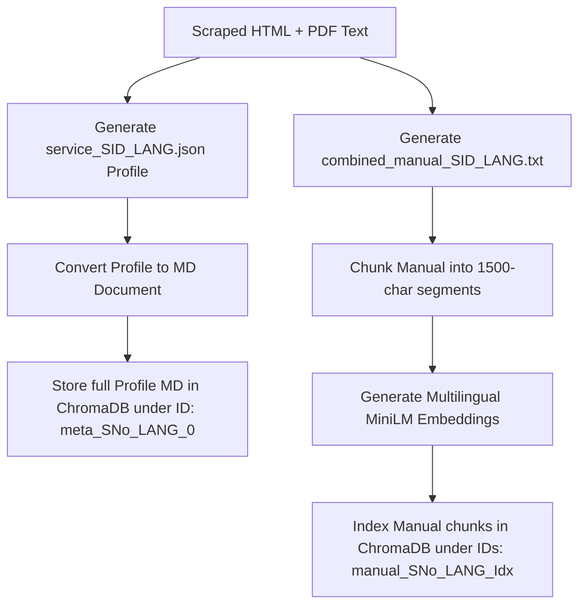
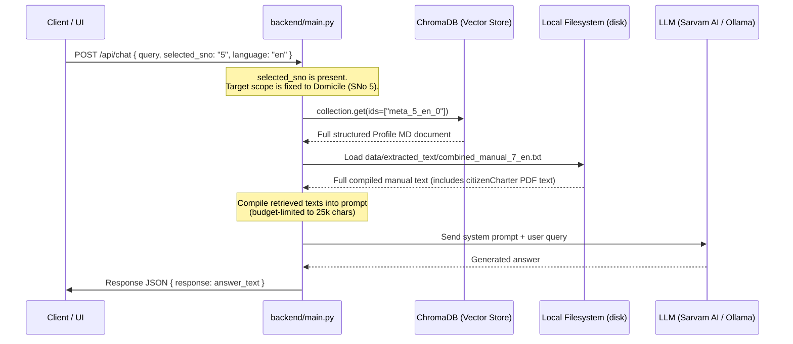
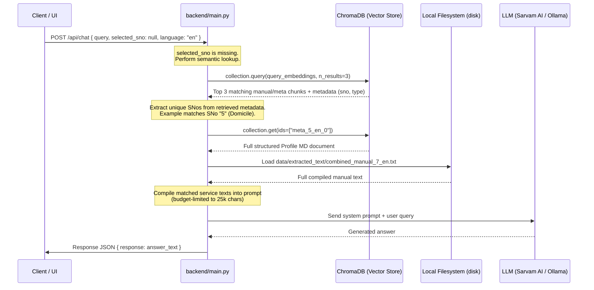
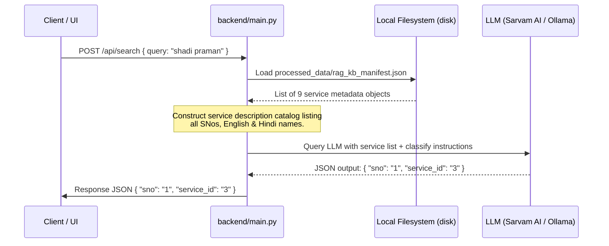

# SewaSetu RAG System: Retrieval Process Flow

This document details the exact process flow used by the SewaSetu RAG chatbot backend to resolve user queries, explain how chunks are retrieved, and identify when the vector store vs. direct file resources are accessed.

---

## Architecture Overview

The backend uses a hybrid storage and retrieval approach designed to avoid chunk truncation and ensure the LLM receives complete context for selected services:

*   **ChromaDB Vector Store**: Used for storing document metadata chunks, indexing compiled manuals, and performing cross-lingual/semantic similarity search.
*   **Local File System Cache**: Houses the original JSON profiles under `data/profiles/` and compiled manual text files (which merge parsed web data + extracted PDF contents) under `data/extracted_text/`.
*   **Context Budgets**: Prompts are constrained to a maximum context budget of **25,000 characters** to ensure fast LLM responses and avoid prompt overflow.

---

## Ingestion Pipeline Flow

Before queries are processed, data must be structured and indexed:

---

## Query Scenarios & Retrieval Flows

When a request is made to `/api/chat` or `/api/search`, the system routes context retrieval through three main scenarios:

### Scenario A: Scoped Chat Query (`selected_sno` is Passed)

This scenario is triggered when the user explicitly selects a service from the dropdown in the UI. 

*   **Vector DB Usage**: ChromaDB is queried directly by exact ID (`meta_5_en_0`) using `collection.get()`. Semantic vector similarity search is **bypassed** since the service context scope is explicitly defined.
*   **Other Resources**: The full compiled manual (including its embedded SLA details text) is loaded directly from disk.

---

### Scenario B: Global Chat Query (`selected_sno` is Null)

This scenario is triggered when the user asks a question globally without choosing a service category.

*   **Vector DB Usage**: ChromaDB is queried using the query's vector embedding. The top 3 matching chunks are retrieved. The system extracts their `sno` metadata to identify which services are relevant. It then fetches the full metadata document for each matching service.
*   **Other Resources**: For each matched service `sno`, the full compiled manual text file is loaded from disk.

---

### Scenario C: Service Classification / Search (`/api/search`)

This endpoint is used when the frontend needs to map a user's free-text search query (in English, Hindi, or Hinglish) to the correct dropdown serial number (`sno`).

*   **Vector DB Usage**: The vector database is **not accessed** at all for this scenario.
*   **Other Resources**: The backend reads `rag_kb_manifest.json` on disk to load the catalog mapping and embeds the entire catalog as a text block inside the system classification prompt.
